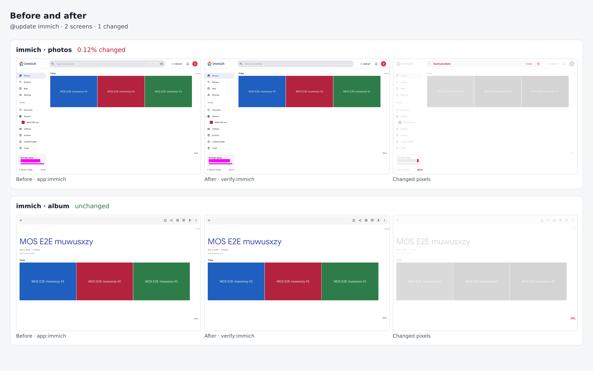

# immich drill on f4195977f1c9

Pull request: [#316](https://github.com/rpuls/my-own-suite/pull/316)

On `f4195977f1c9`: `@update immich` passed, `@app-dr immich` passed.

#### `@update immich` passed

✓ reset · ✓ owner · ✓ install:immich · ✓ app:immich · ✓ platform-update:wait · ✓ update:immich · ✓ verify:immich · ✓ routes · ✓ compare · ✓ network

Screens that changed: immich/photos 0.1%.

##### Network: Problems

None.

##### Network: immich

Updated in `update:immich`: Before is everything until that step, After is from it on.

| Host | Channel | From | Steps | Before | After | In review |
| --- | --- | --- | --- | --- | --- | --- |
| `www.modelscope.cn` | server | immich-machine-learning | app:immich, platform-update:wait | ✓ |  | yes |
| `cdn-lfs-cn-1.modelscope.cn` | server | immich-machine-learning | app:immich, platform-update:wait | ✓ |  | yes |
| `huggingface.co` | server | immich-machine-learning | app:immich | ✓ |  | yes |
| `cas-server.xethub.hf.co` | server | immich-machine-learning | app:immich, platform-update:wait | ✓ |  | yes |
| `us.aws.cdn.hf.co` | server | immich-machine-learning | app:immich, platform-update:wait | ✓ |  | yes |

New after the update: none.

#### `@app-dr immich` passed

✓ reset · ✓ owner · ✓ install:immich · ✓ app:immich · ✓ backup:bucket · ✓ reset · ✓ owner · ✓ restore:bucket · ✓ verify:immich · ✓ routes · ✓ network · ✓ cleanup

##### Network: Problems

None.

##### Network: immich

| Host | Channel | From | Steps | In review |
| --- | --- | --- | --- | --- |
| `huggingface.co` | server | immich-machine-learning | app:immich, backup:bucket | yes |
| `cas-server.xethub.hf.co` | server | immich-machine-learning | app:immich, backup:bucket | yes |
| `us.aws.cdn.hf.co` | server | immich-machine-learning | app:immich, backup:bucket | yes |
| `www.modelscope.cn` | server | immich-machine-learning | app:immich, backup:bucket | yes |
| `cdn-lfs-cn-1.modelscope.cn` | server | immich-machine-learning | app:immich | yes |

### update: before and after

