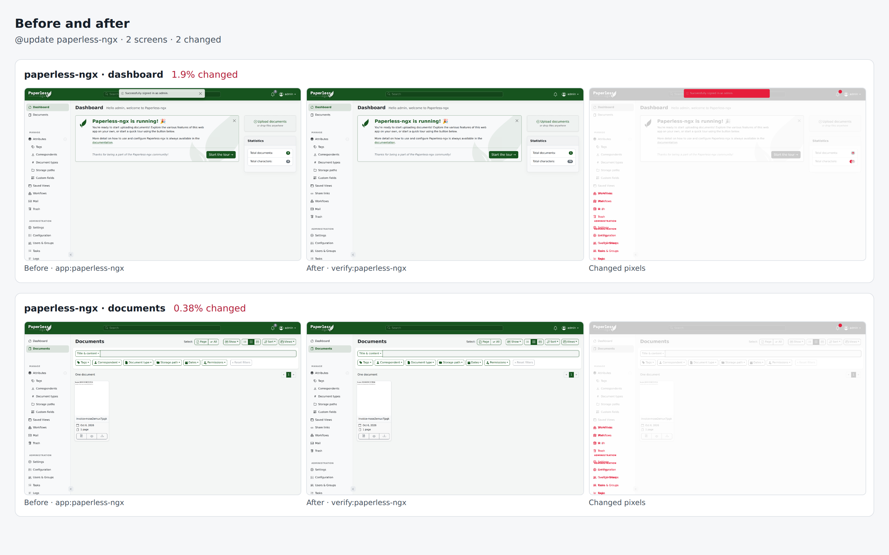

# paperless-ngx drill on 86c500d0f307

Pull request: [#318](https://github.com/rpuls/my-own-suite/pull/318)

On `86c500d0f307`: `@update paperless-ngx` passed, `@app-dr paperless-ngx` passed.

#### `@update paperless-ngx` passed

✓ reset · ✓ owner · ✓ install:paperless-ngx · ✓ app:paperless-ngx · ✓ platform-update:wait · ✓ update:paperless-ngx · ✓ verify:paperless-ngx · ✓ routes · ✓ compare · ✓ network

Screens that changed: paperless-ngx/dashboard 1.9%, paperless-ngx/documents 0.4%.

##### Network: Problems

None.

#### `@app-dr paperless-ngx` passed

✓ reset · ✓ owner · ✓ install:paperless-ngx · ✓ app:paperless-ngx · ✓ backup:bucket · ✓ reset · ✓ owner · ✓ restore:bucket · ✓ verify:paperless-ngx · ✓ routes · ✓ network · ✓ cleanup

##### Network: Problems

None.

### update: before and after

