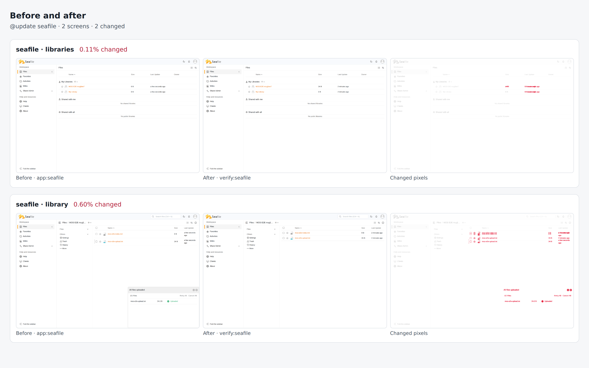

# seafile drill on 68b597071538

Pull request: [#320](https://github.com/rpuls/my-own-suite/pull/320)

On `68b597071538`: `@update seafile` passed, `@app-dr seafile` passed.

#### `@update seafile` passed

✓ reset · ✓ owner · ✓ install:seafile · ✓ app:seafile · ✓ platform-update:wait · ✓ update:seafile · ✓ verify:seafile · ✓ routes · ✓ compare · ✓ network

Screens that changed: seafile/libraries 0.1%, seafile/library 0.6%.

##### Network: Problems

None.

#### `@app-dr seafile` passed

✓ reset · ✓ owner · ✓ install:seafile · ✓ app:seafile · ✓ backup:bucket · ✓ reset · ✓ owner · ✓ restore:bucket · ✓ verify:seafile · ✓ routes · ✓ network · ✓ cleanup

##### Network: Problems

None.

### update: before and after

