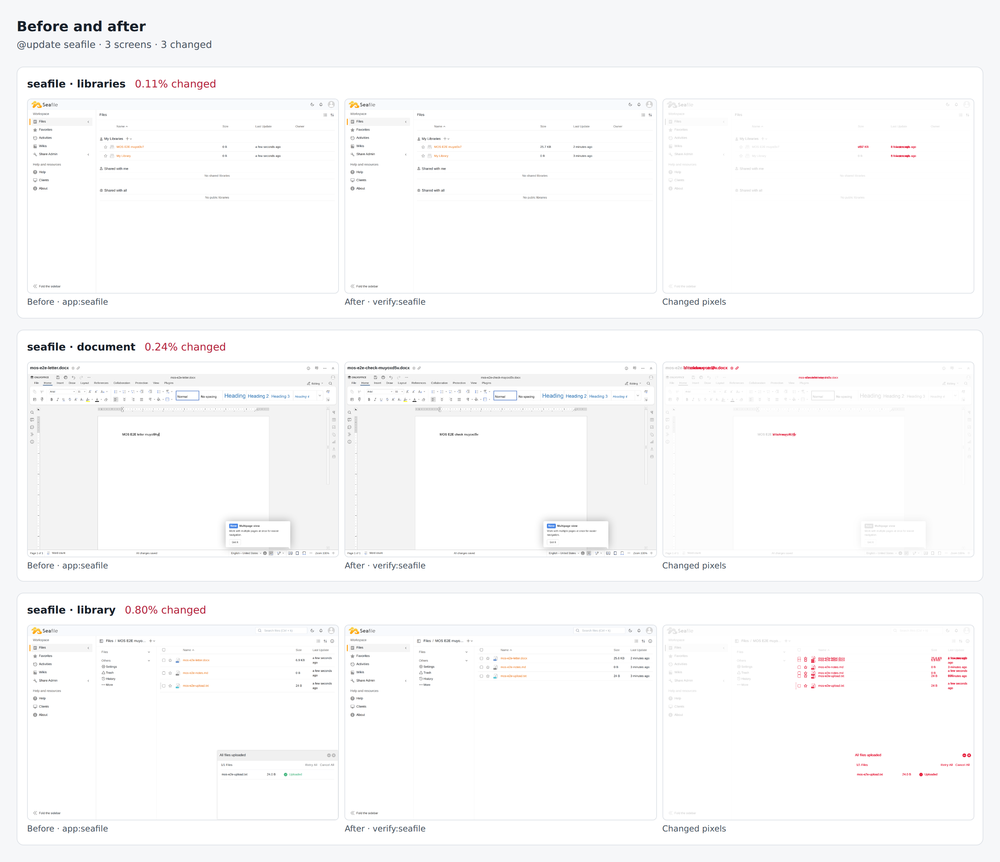

# seafile drill on 810b3f6805aa

Pull request: [#320](https://github.com/rpuls/my-own-suite/pull/320)

On `810b3f6805aa`: `@update seafile` passed, `@app-dr seafile` passed.

#### `@update seafile` passed

✓ reset · ✓ owner · ✓ install:onlyoffice · ✓ install:seafile · ✓ connect · ✓ app:onlyoffice · ✓ app:seafile · ✓ platform-update:wait · ✓ update:seafile · ✓ verify:onlyoffice · ✓ verify:seafile · ✓ routes · ✓ compare · ✓ network

- `app:seafile`: ✓ sign in · ✓ create a library · ✓ create a file in it · ✓ upload a file, download it back and share it publicly · ✓ create a Word document, write in it in the connected office editor, save it and read it back
- `verify:seafile`: ✓ sign in · ✓ the uploaded file and its public link still serve its content · ✓ the document written in the office editor kept its text and still opens in it · ✓ create a new Word document, write in it in the office editor, save it and read it back

Screens that changed: seafile/libraries 0.1%, seafile/document 0.2%, seafile/library 0.8%.

##### Network: Problems

None.

#### `@app-dr seafile` passed

✓ reset · ✓ owner · ✓ install:onlyoffice · ✓ install:seafile · ✓ connect · ✓ app:onlyoffice · ✓ app:seafile · ✓ backup:bucket · ✓ reset · ✓ owner · ✓ restore:bucket · ✓ verify:onlyoffice · ✓ verify:seafile · ✓ routes · ✓ network · ✓ cleanup

- `app:seafile`: ✓ sign in · ✓ create a library · ✓ create a file in it · ✓ upload a file, download it back and share it publicly · ✓ create a Word document, write in it in the connected office editor, save it and read it back
- `verify:seafile`: ✓ sign in · ✓ the uploaded file and its public link still serve its content · ✓ the document written in the office editor kept its text and still opens in it · ✓ create a new Word document, write in it in the office editor, save it and read it back

##### Network: Problems

None.

### update: before and after

