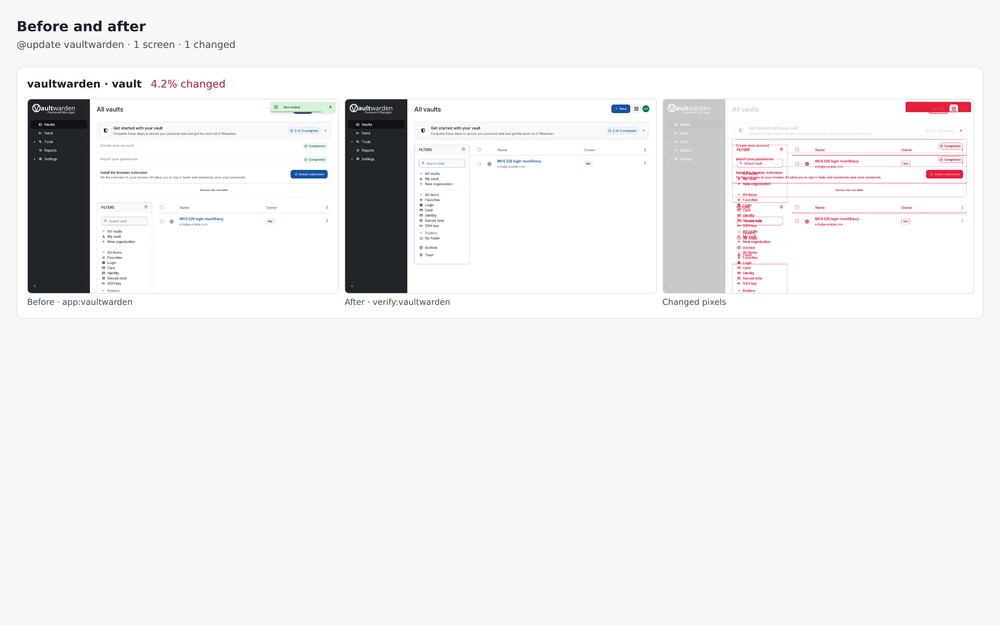

# vaultwarden drill on 14e725130aa3

Pull request: [#317](https://github.com/rpuls/my-own-suite/pull/317)

On `14e725130aa3`: `@update vaultwarden` passed, `@app-dr vaultwarden` passed.

#### `@update vaultwarden` passed

✓ reset · ✓ owner · ✓ dns01 · ✓ install:vaultwarden · ✓ app:vaultwarden · ✓ platform-update:wait · ✓ update:vaultwarden · ✓ verify:vaultwarden · ✓ routes · ✓ compare · ✓ network

Screens that changed: vaultwarden/vault 4.2%.

##### Network: Problems

None.

##### Network: vaultwarden

Updated in `update:vaultwarden`: Before is everything until that step, After is from it on.

| Host | Channel | From | Steps | Before | After | In review |
| --- | --- | --- | --- | --- | --- | --- |
| `api.pwnedpasswords.com` | browser | vaultwarden.r37509511472.lab.my-demo-domain.site | app:vaultwarden, verify:vaultwarden | ✓ | ✓ | yes |

New after the update: none.

#### `@app-dr vaultwarden` passed

✓ reset · ✓ owner · ✓ dns01 · ✓ install:vaultwarden · ✓ app:vaultwarden · ✓ backup:bucket · ✓ reset · ✓ owner · ✓ restore:bucket · ✓ dns01 · ✓ verify:vaultwarden · ✓ routes · ✓ network · ✓ cleanup

##### Network: Problems

None.

##### Network: vaultwarden

| Host | Channel | From | Steps | In review |
| --- | --- | --- | --- | --- |
| `api.pwnedpasswords.com` | browser | vaultwarden.r37509511472.lab.my-demo-domain.site | app:vaultwarden, verify:vaultwarden | yes |

### update: before and after

